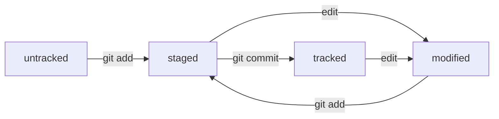

### Common commands:
- `git status`
- `git add --all`
- `git commit -m 'Commit message'`
- `git log`
    - `--oneline` — for short info

### How to generate SSH key for remote repo
```bash
ssh-keygen -t ed25519 -C "ydnx-klochkov-alex@yandex.ru" -f github
```
Check connection to remote repo
```bash
ssh -T git@github.com -i github
```

### How to add remote repo:
```bash
git remote add origin git@github.com:klochkov-alex/learning.git
```
### How to push to remote repo:
```bash
git push -u origin main #(push main branch to origin; origin is set by --set-upstream a.k.a -u)
```

### About HEAD
HEAD always points to the latest commit

### File statuses
- untracked
- tracked
- modified
- staged

```
 __________ 
|          |
| modified |________ git add __________
|__________|                          |
         __________                ___V_____ 				    _________
        |          |<-- edit -----|         |                  |         |
     -->| modified |              | staged  |--- git commit -->| tracked |
    |   |__________|-- git add -->|_________|                  |_________|
    |                                                               |
    |____________________________edit_______________________________|
```

### How to make diagrams

Use [mermaid](https://github.blog/developer-skills/github/include-diagrams-markdown-files-mermaid/):



### How to edit the latest commit
1. Make changes;
2. Add them to the latest commit:
   ```bash
     git commit --amend --no-edit
   ```
   `--no-edit` means no edit for commit message (leave the same as it was);

### How to edit the message from the latest commit

```bash
git commit --amend -m "<new message>"
```

### Remove files from stagin area

```bash
git restore --staged <file>
```

### Delete commits until <hash>

Check has for the commit:
```
git log --oneline
```

Delete commits:
```
git reset --hard <commit>
```