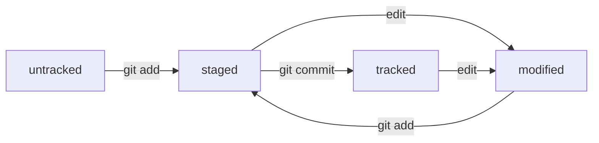

### Common commands:
- `git status`
- `git add --all`
- `git commit -m 'Commit message'`
- `git log`
    - `--oneline` — for short info

### How to generate SSH key for remote repo
```bash
ssh-keygen -t ed25519 -C "ydnx-klochkov-alex@yandex.ru" -f github
```
Check connection to remote repo
```bash
ssh -T git@github.com -i github
```

### How to add remote repo:
```bash
git remote add origin git@github.com:klochkov-alex/learning.git
```
### How to push to remote repo:
```bash
git push -u origin main #(push main branch to origin; origin is set by --set-upstream a.k.a -u)
```

### About HEAD
HEAD always points to the latest commit

### File statuses
- untracked
- tracked
- modified
- staged

```
 __________ 
|          |
| modified |________ git add __________
|__________|                          |
         __________                ___V_____ 				    _________
        |          |<-- edit -----|         |                  |         |
     -->| modified |              | staged  |--- git commit -->| tracked |
    |   |__________|-- git add -->|_________|                  |_________|
    |                                                               |
    |____________________________edit_______________________________|
```

### How to make diagrams

Use [mermaid](https://github.blog/developer-skills/github/include-diagrams-markdown-files-mermaid/):



### How to edit the latest commit
1. Make changes;
2. Add them to the latest commit:
   ```bash
     git commit --amend --no-edit
   ```
   `--no-edit` means no edit for commit message (leave the same as it was);

### How to edit the message from the latest commit

```bash
git commit --amend -m "<new message>"
```

### Remove files from stagin area

```bash
git restore --staged <file>
```

### Delete commits until <hash>

Check has for the commit:
```bash
git log --oneline
```

Delete commits:
```bash
git reset --hard <commit>
```

### How to see changes from modified and staged

Use git diff to see modified files:
```bash
git diff
```

For staged, use `--staged`:
```bash
git diff --staged
```

### How to see changes between two commits

```bash
git diff <hash1> <hash2>
```

**Note**: for the latest commit you can use `HEAD`

### About `.gitignore`

Filename:
```
# для macOS
.DS_Store 

# Git будет игнорировать файлы с именем .DS_Store, 
# причём не только в корне репозитория, но и во всех вложенных папках.
```

Звездочка `*`
```
# игнорировать все файлы, которые заканчиваются на .jpeg
*.jpeg

# игнорировать все файлы "tmp" во всех подпапках папки docs
docs/*/tmp 
```

### Вопросительный знак `?` и `[]`
```
file?.txt 

# игнорировать файлы file0.txt, file1.txt и file2.txt
# при этом не игнорировать file3.txt, file4.txt, ...
file[0-2].txt
```

### Слэш `/`
```
# Косая черта, или слеш (/), указывает на каталоги. 
# Если шаблон в .gitignore начинается со слеша, 
# то Git проигнорирует файлы или каталоги только в корневой директории.

# игнорировать todo.txt в корне репозитория
/todo.txt

# для сравнения: spam.txt будет игнорироваться во всех папках
spam.txt 

# игнорировать папку build
build/ 
```

### Парные звёздочки `(**)`
```
# игнорировать файлы "docs/current/tmp", "docs/old/tmp",
# а также "docs/old/saved/a/b/c/d/tmp"
# и даже "docs/tmp", потому что ноль вложенных папок тоже подходит
docs/**/tmp

# игнорировать только "docs/current/tmp" и "docs/old/tmp"
# файл "docs/old/saved/a/b/c/d/tmp" не попадает в правило
docs/*/tmp
```

### Восклицательный знак `!`
```
# игнорировать все JPEG-файлы
*.jpeg

# но только не мем с Doge
!doge.jpeg
```

### Проверить, какие файлы git игноририует
```bash
git status --ignored`
```